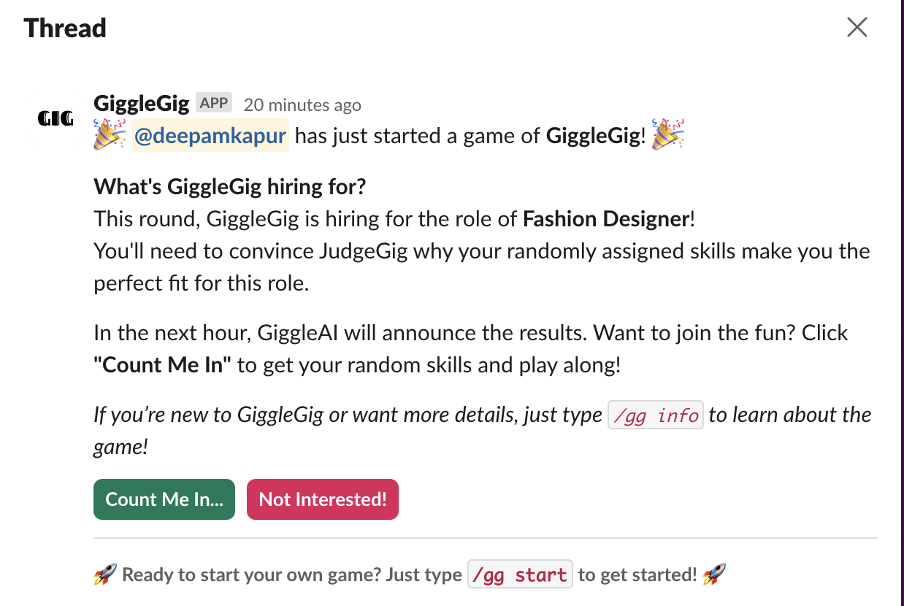
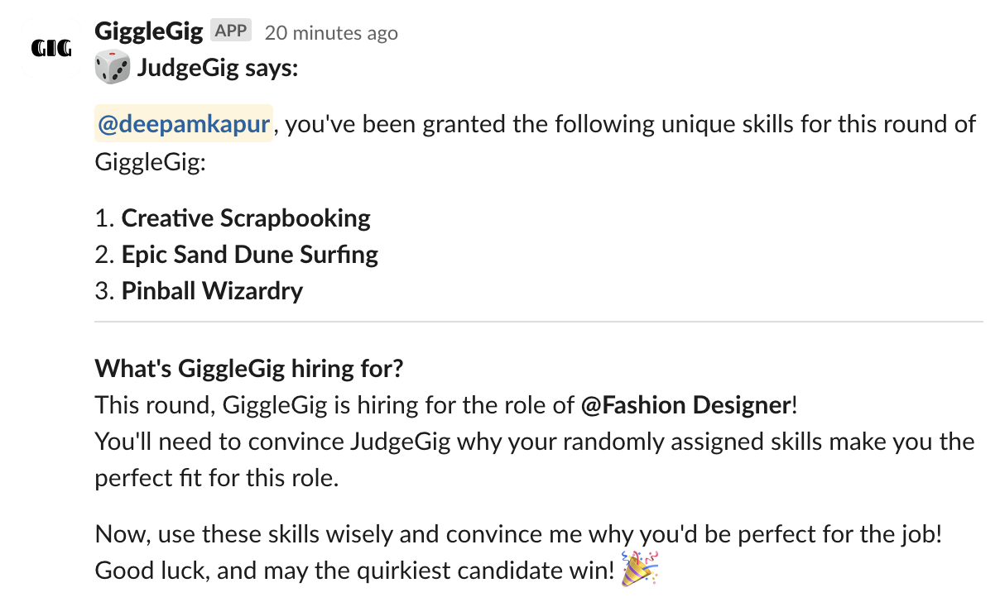

# GiggleGig

GiggleGig is a fun and interactive Slack game where participants are assigned random job roles (like Doctor or Lawyer) and three unique skills. The challenge? Convince an AI judge why those quirky skills make you the perfect fit for the job role!


## Table of Contents
- [GiggleGig](#gigglegig)
  - [Table of Contents](#table-of-contents)
  - [Introduction](#introduction)
    - [Example](#example)
  - [Screenshots Examples](#screenshots-examples)
  - [Requirements](#requirements)
  - [Installation](#installation)
  - [Usage](#usage)
  - [Features](#features)

## Introduction

GiggleGig is designed to add some light-hearted fun to your Slack workspace. Whether you're looking for a team-building activity or just some entertainment during breaks, GiggleGig is here to bring laughter and creativity to the table.

### Example

## Screenshots Examples
When you hit `/gg start`

When you hit Count me In button you get


## Requirements

Before installing and running GiggleGig, make sure you have the following installed:

- **Node.js** (v14.x or higher)
- **TypeScript** (v4.x or higher)
- **MySQL** (v8.x or higher)
- **Ollama** (latest version)

These dependencies are essential for running the GiggleGig Slack app and ensuring smooth operation.

## Installation

To add GiggleGig to your Slack workspace:

1. Clone this repository:
   ```bash
   git clone https://github.com/yourusername/gigglegig.git
   ```
2. Navigate to the project directory:
   ```bash
   cd gigglegig
   ```
3. Install the necessary dependencies:
   ```bash
   npm install
   ```
4. Set up your Slack App and configure environment variables:
   - Follow the instructions in the [Slack API documentation](https://api.slack.com/) to create your app.
   - Add the required environment variables in a `.env` file.

5. Start the application:
   ```bash
   npm start
   ```

## Usage

To play GiggleGig in your Slack workspace:

1. Invite the GiggleGig app to your Slack channel.
2. Start a game by typing `/gg start`.
3. Each participant will receive a random job role and three unique skills.
4. Convince the AI judge why those skills make you the perfect candidate for the job role!
5. Type `/gg info` to get detailed information about the game.

## Features

- **Random Job Roles and Skills:** GiggleGig assigns random and unique job roles and skills to participants.
- **AI Judge:** An AI judge evaluates participants' arguments and decides the winner.
- **Fun for All:** Perfect for team-building activities or just some fun during work breaks.
